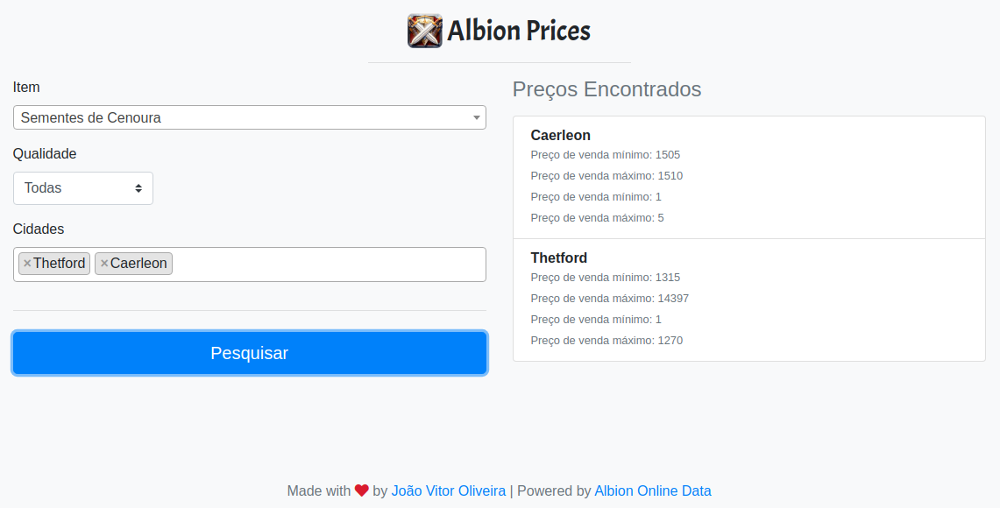

# Albion-Prices
Consome uma API para consultar preço dos itens de Albion Online em diferentes cidades do jogo.

# Iniciando
Permite comparar preços de itens das cidades do jogo Albion Online.

Consome e exibe dados da API [THE ALBION ONLINE DATA PROJECT](https://www.albion-online-data.com/).

A ideia é poder comparar o preço das cidades próximas a sua para vender ou comprar itens num preço melhor.

# Screenshot

